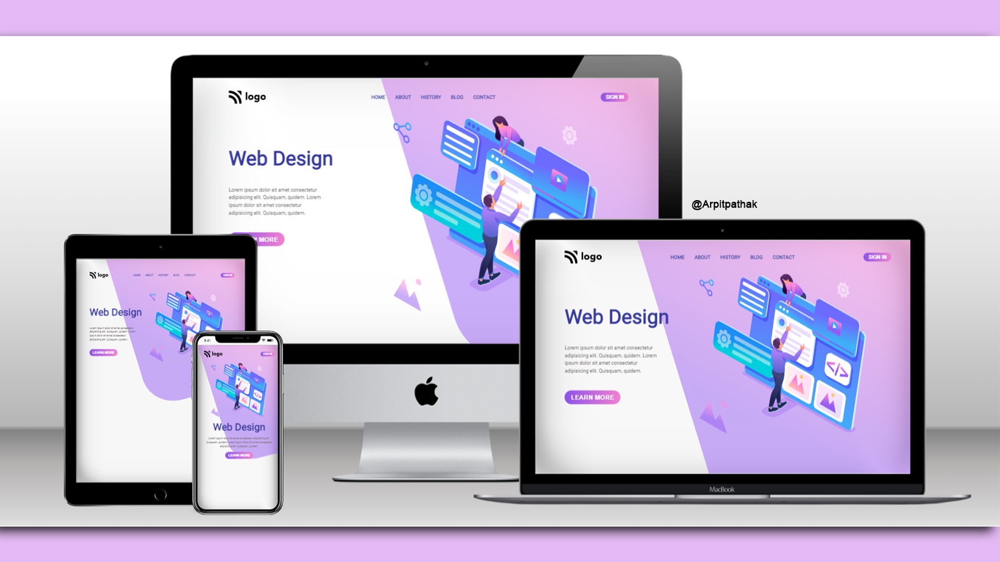

# Web Design Agency (Landing Page)

## Project 08 🚀 Website's [Live Link](https://web-designer-agency.netlify.app/)🔗

>by Arpit Pathak

Screenshot

website on different devices 

## 📌 What I learned from this Project? 📝

- Learned to use CSS position (Absolute & Relative) properties.
- Learn to beautify buttons with the help of `linear-gradients`.
- Learned about Flexbox and its properties `justify-content` & `align-items`.
- Learned how to use & position elements(images and illustration).
- Learned about `media queries` to make website responsive

## 📌 Time taken to finish this project ⏳
- 1.5 hours + 20 min for making website responsive

---

